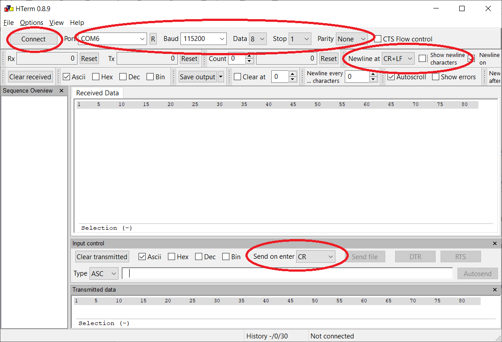
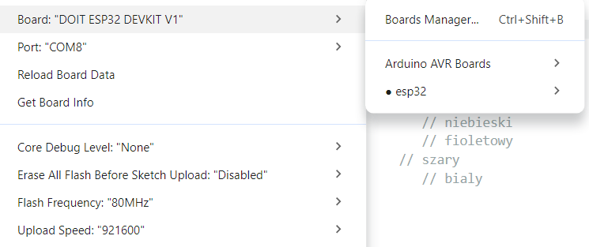
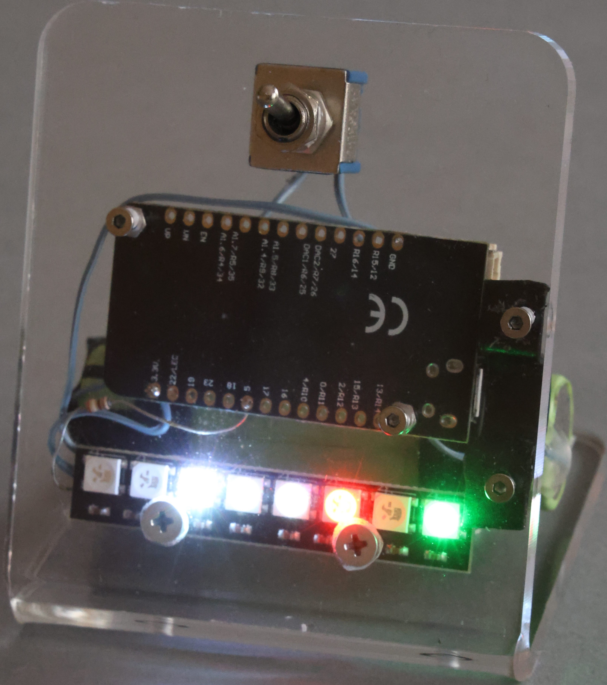

## Instrukcja obsługi dla zwykłych użytkowników
1. Pobierz i uruchom program HTerm ([HTerm](https://www.der-hammer.info/pages/terminal.html)) lub inny.
2. Podłącz zegarek do portu USB i sprawdź w „menedżerze urządzeń”, na którym porcie pojawi się zegarek (szukaj układu CH340).
3. W programie Hterm wybierz w polu „Port” oznaczenie portu zgodnie z p. 2. Baud – 115200, 
    „Data” – 8, „Stop” – 1, 
    „Parity” – None, 
    „Newline at” – CR+LF, 
    „Send on enter” – CR. 
    Odznacz pole „Show newline character” (rys. 1). 
    Kliknij przycisk „Connect”.
4. Wciśnij przycisk RESET w zegarku. Możesz to zrobić długopisem, wkrętakiem lub małym palcem.
5. W oknie „Received Data” Powinien pojawić się komunikat podobny do tego 
```
„Wciśnij Enter, aby skonfigurować WiFi”. 
```
Zrób to. Przed wciśnięciem klawisza upewnij się, że kursor znajduje się w oknie „Input control”.
6. Od momentu wciśnięcia klawisza „Enter” masz, zgodnie z komunikatem w oknie „Received data”, jedną minutę na wpisanie nazwy SSID dostępnej sieci WiFi oraz klucza do tej sieci. Między nazwą, a kluczem jest odwrotny ukośnik. Po wpisaniu danych wciśnij „Enter”.

## Instrukcja obsługi dla programistów
1. Zainstaluj środowisko Arduino.
2. Dodaj płytkę esp32.



## Schemat elektryczny
```
ESP32 +3.3V ------------------------> VCC WS2812

ESP32 GND --------------------------> GND WS2812

                    330 Ω
ESP32 GPIO 5 ------[    ]-----------> DIN WS2812
```

