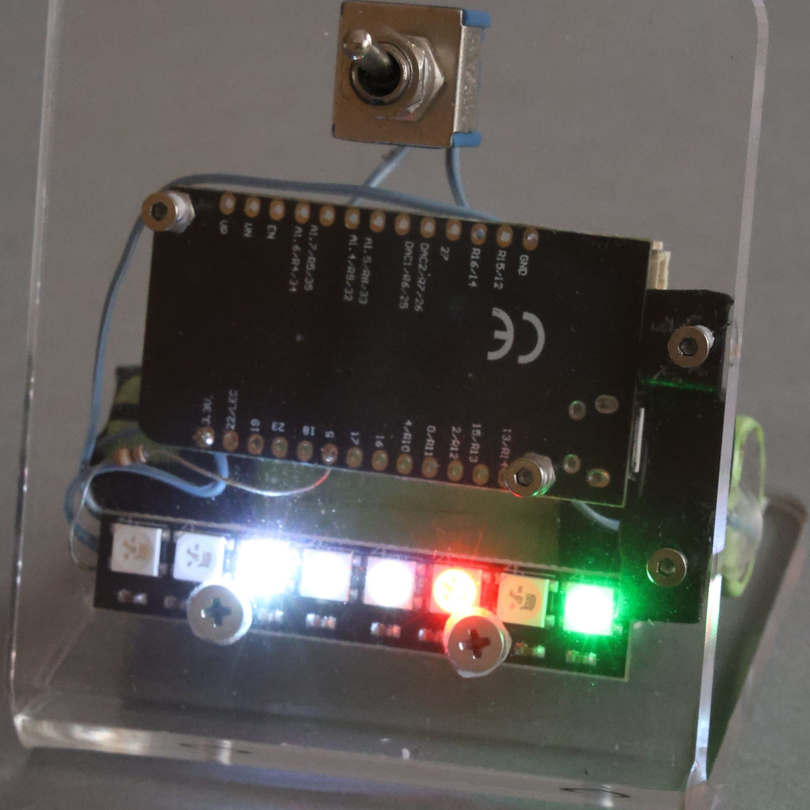

## Opis
Zegarek po włączeniu zasilania pobiera godzinę z internetu zapisuje w RTC układu ESP32.
W pętli odczytuje czas z RTC i wyświetla na kolorowych diodach LED.
Wciśnięcie przycisku powoduje wyświetlenie czasu na diodach przez 10 s.

## Instrukcja konfigurowania sieci WiFi za pomocą przeglądarki internetowej
1. Wciśnij i przytrzymaj przycisk na przednim panelu w zegarku i włącz zasilanie zegarka lub wciśnij na chwilę przycisk reseet w zegarku, zwolnij przycisk na przednim panelu.
2. Przy pomocy dowolnego urządzenia z przeglądarką internetową połącz się z siecią WiFi o nazwie "zegarek". Klucz sieciowy (hasło) to 12345678.
3. Wpisz w przeglądarce adres 192.168.31.1, wypełnij formularz i kliknij "Zapisz".
4. Ponownie uruchom zegarek poprzez ponowne włączenia zasilania lub wciśnięcie przycisku "reset".
## Instrukcja konfigurowania sieci WiFi z terminala
1. Pobierz i uruchom program [HTerm](https://www.der-hammer.info/pages/terminal.html).
2. Podłącz zegarek do portu USB i sprawdź w „menedżerze urządzeń”, na którym porcie pojawi się zegarek (szukaj układu CH340).
3. W programie Hterm wybierz w polu „Port” oznaczenie portu zgodnie z p. 2.
    - "Baud" – 115200, 
    - „Data” – 8,
    - „Stop” – 1, 
    - „Parity” – None, 
    - „Newline at” – CR+LF, 
    - „Send on enter” – CR. 
    - Odznacz pole „Show newline character” (rys. 1). 
    - Kliknij przycisk „Connect”.

5. Wciśnij przycisk RESET w zegarku. Możesz to zrobić długopisem, wkrętakiem lub małym palcem.
6. W oknie „Received Data” Powinien pojawić się komunikat podobny do tego 
```
„Wciśnij Enter, aby skonfigurować WiFi”. 
```
Zrób to. Przed wciśnięciem klawisza upewnij się, że kursor znajduje się w oknie „Input control”.

6. Od momentu wciśnięcia klawisza „Enter” masz, zgodnie z komunikatem w oknie „Received data”, jedną minutę na wpisanie nazwy SSID dostępnej sieci WiFi oraz klucza do tej sieci. Między nazwą, a kluczem jest odwrotny ukośnik. Po wpisaniu danych wciśnij „Enter”.

## Instrukcja obsługi dla programistów
1. Zainstaluj środowisko Arduino.
2. Dodaj [płytkę](https://espressif.github.io/arduino-esp32/package_esp32_index.json) esp32.
    1. W polu "Dodatkowe adresy URL do menedżera płytek" wklej: https://espressif.github.io/arduino-esp32/package_esp32_index.json
    2. Wybierz Tools → Board → Boards Manager
    3. Wpisz w wyszukiwarkę: esp32 Powinien pojawić się pakiet od Espressif Systems.
    4. Kliknij Zainstaluj.
    5. Po instalacji przejdź do: Narzędzia → Płytka → ESP32 Arduino i wybierz model DOIT ESP32 DEVKIT V1.
3. Dodaj bibliotekę Adafruit NeoPixel
    1. Wejdź w Narzędzia → Zarządzaj bibliotekami… (lub Sketch → Include Library → Manage Libraries…)
    2. W polu wyszukiwania wpisz: Adafruit NeoPixel
    3. Wybierz bibliotekę od Adafruit i kliknij Install


## Schemat elektryczny
```
ESP32 +3.3V ------------------------> VCC WS2812

ESP32 GND --------------------------> GND WS2812

ESP32 GPIO 5 -----------------------> DIN WS2812

                   przycisk NO
ESP32 GPIO 25 -----[    ]-----------> GND
```

