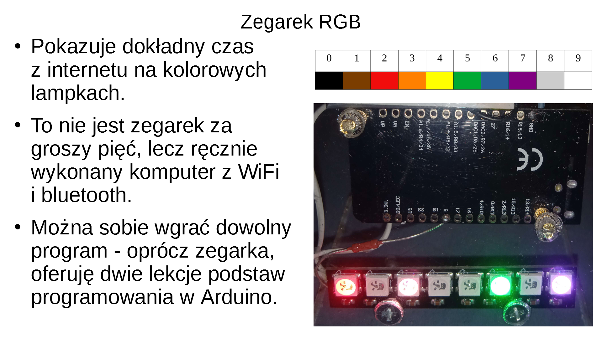

## Schemat elektryczny
```
ESP32 +3.3V ------------------------> VCC WS2812

ESP32 GND --------------------------> GND WS2812

                    330 Ω
ESP32 GPIO 5 ------[    ]-----------> DIN WS2812
```
Do programowania parametrów sieci WiFi polecam
[HTerm](https://www.der-hammer.info/pages/terminal.html)
